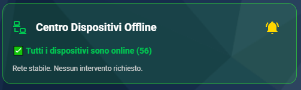
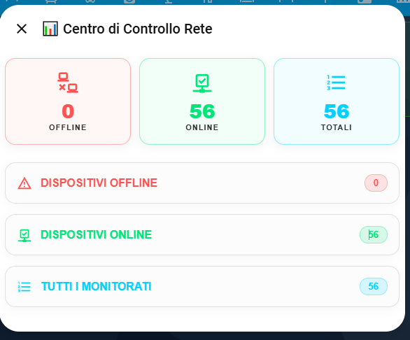

# 📡 DomHouse - Centro Dispositivi Offline Card

**Centro Dispositivi Offline Card** è una plancia Lovelace personalizzata dal design Premium (stile Glassmorphism) per Home Assistant. 
Progettata per lavorare in perfetta sinergia con il backend [Centro Dispositivi Offline Custom Component](https://github.com/SalvatoreITA/Centro-Dispositivi-Offline), questa card offre una dashboard visiva spettacolare e un popup nativo interattivo per monitorare lo stato di connessione della tua smart home.

## 📸 Anteprima

  

  

## ✨ Funzionalità Principali

* **Design Premium Octopus Style:** Colori brillanti, bordi arrotondati e riquadri traslucidi per un'estetica moderna.
* **Popup Nativo Interattivo:** Cliccando sulla card, si aprirà un popup elegante suddiviso in schede a tendina con i dettagli esatti di quali dispositivi sono Online, Offline o non trovati (❓).
* **Motore Grafico Stabile:** Il popup ha una memoria di stato integrata. Si aggiorna in tempo reale solo quando c'è un vero cambiamento effettivo nei dispositivi, evitando lag, loop o fastidiose chiusure accidentali.
* **Tasto Campanella Integrato:** Abilita o disabilita l'automazione delle notifiche Telegram/App direttamente dalla card con un tocco.
* **Editor UI Nativo:** Nessun codice YAML richiesto. Configura sensori, titoli e automazioni direttamente dall'editor visivo di Home Assistant.

## ⚠️ Prerequisiti

Per far funzionare correttamente questa card, devi aver installato:
1. **[Centro Dispositivi Offline Custom Component](https://github.com/SalvatoreITA/Centro-Dispositivi-Offline):** Il "motore" backend che genera i sensori puliti necessari.
2. **[Browser Mod](https://github.com/thomasloven/hass-browser_mod):** Indispensabile per far apparire le finestre popup su Home Assistant.

## 📦 Installazione

### Metodo 1: Tramite HACS (Consigliato)
1. Apri **HACS** in Home Assistant.
2. Vai su **Frontend** > clicca sui tre puntini in alto a destra > **Repository personalizzati**.
3. Incolla l'URL di questa repository e seleziona la categoria **Dashboard/Lovelace**.
4. Clicca su Aggiungi, cerca "DomHouse Centro Dispositivi Offline Card" e clicca su **Scarica**.
5. Ricarica la pagina del browser (o l'app di Home Assistant).

### Metodo 2: Manuale
1. Scarica il file `centro-offline-card.js` dall'ultima release.
2. Copia il file all'interno della cartella `www/` (o `local/`) del tuo Home Assistant.
3. Vai su **Impostazioni** > **Dashboard** > **Risorse** e aggiungi il percorso `/local/centro-offline-card.js` impostando il tipo su **Modulo JavaScript**.
4. Ricarica la pagina.

## ⚙️ Configurazione da UI

Aggiungere la card è semplicissimo:
1. Vai sulla tua Dashboard e clicca su **Modifica plancia**.
2. Clicca su **Aggiungi scheda** e cerca `DomHouse - Centro Dispositivi Offline Card`.
3. Nell'editor visivo potrai configurare:
   * **Titolo della Card:** (es. "Centro di Controllo").
   * **Automazione Notifiche (Obbligatorio):** Seleziona la tua automazione di avviso offline (questo abiliterà il funzionamento della campanella).
   * **Sensori Collegati (Opzionali):** I campi sono già precompilati con i nuovi sensori standard generati dall'integrazione (`sensor.dispositivi_offline`, `sensor.dispositivi_online`, `sensor.dispositivi_totali`). Modificali solo se li hai cambiati manualmente.
4. Salva e goditi il risultato!

## ☕ Supporta il Progetto

Ogni piccolo supporto fa un'enorme differenza: mi aiuta a mantenere vivo l'entusiasmo e mi stimola a creare e condividere nuove soluzioni per la community. Grazie di cuore per il tuo aiuto! 🚀

## ❤️ Crediti
Sviluppato da [Salvatore Lentini - DomHouse.it](https://www.domhouse.it)
